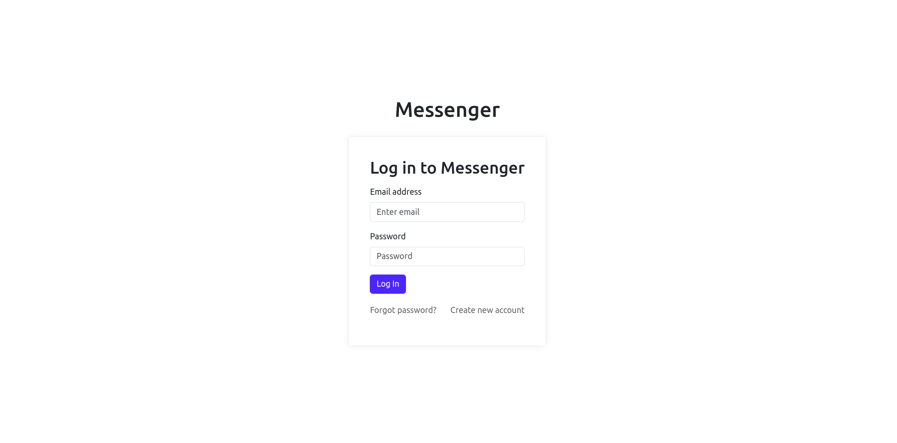

# Chat App

This repository contains a chat app with several functionalities similar to a messenger. The app allows users to register, login, view their conversations, and engage in one-on-one chats with other participants. It currently supports conversations between two people. Additionally, there is a search bar available to find new friends by their username. Upon finding a user in the search results, you can visit their profile and click the "Add friend" button to include them in your conversations list and start chatting with them. The project is built using React for the frontend, Django for the backend API, MySQL for the database.

## Features

- User registration and login
- Conversation management
- One-on-one chat functionality
- User search by username
- Adding friends to conversations

## Technologies Used

- React (Frontend)
- Django (Backend API)
- MYSQL (database)

## Setup Instructions

1.  Clone the repository:

    ```bash
    git clone https://github.com/your-username/chat-app.git
    ```

2.  Navigate to the project directory
    ```bash
    cd chat-app
    ```
3.  Set up the frontend:
    ```bash
    cd frontend
    npm install
    ```
4.  Set up MySQL:

        - Install MySQL on your machine if you haven't already.
        - Create a new MySQL database for the project.

5.  Configure the Django settings to use MySQL:

    - In the backend/backend/settings.py file, locate the DATABASES section.
    - Update the DATABASES configuration to use your MySQL database credentials:

    ```python
        DATABASES = {
        'default': {
            'ENGINE': 'django.db.backends.mysql',
            'NAME': 'your_database_name',
            'USER': 'your_mysql_username',
            'PASSWORD': 'your_mysql_password',
            'HOST': 'localhost',
            'PORT': '3306',
        }
    }
    ```

6.  Set up the backend:

    ```bash
    cd ../backend
    # Set up your virtual environment (Optional)
    python3 -m venv venv
    source venv/bin/activate
    # Install dependencies
    pip install -r requirements.txt
    # Perform database migrations
    python manage.py migrate
    ```

7.  Start the frontend development server:
    ```bash
    cd ../frontend
    npm run dev
    ```
8.  Start the backend server in another terminal:
    ```bash
    cd ../backend
    python manage.py runserver
    ```
9.  Access the app in your web browser at http://localhost:5173.

[](./chat-app-demo.mp4)
